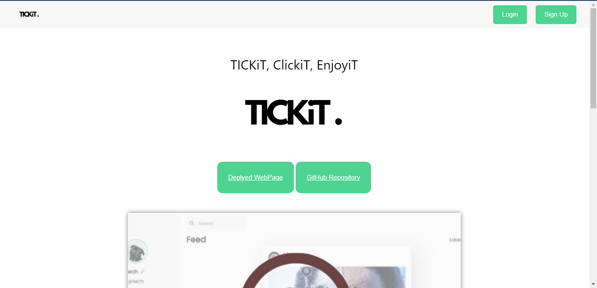
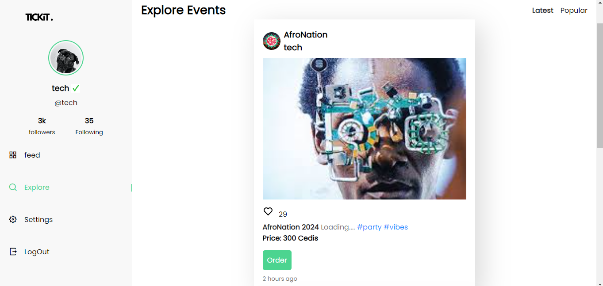

<h1 align="center" id="title">TICKiT</h1>

<p align="center"></p>

<p id="description">The TICKiT event web service seeks to tackle the challenge of streamlining and simplifying the process of ticket procurement for a diverse range of events including conferences sports and entertainment. The current landscape often involves fragmented ticketing platforms making it challenging for users to discover purchase and manage tickets seamlessly.</p>

<h2>Project Screenshots:</h2>

<h3>Welcome Page</h3>




<h3>Home Page</h3>



<h2>🧐 Features</h2>

Here're some of the project's best features:

*   Login
*   SignUp
*   Order
*   Payment


<h2>🛠️ Installation Steps:</h2>

<p>1. Cloning Repository</p>

```
Tap on "Code" on the Repository
```

```
copy either an http link or ssh link
```

```
Then git clone "repo link" on local machine 
```


<h2>💻 Built with</h2>

Technologies used in the project:

*   HTML5
*   CSS3
*   JAVASCRIPT
*   SQLITE
*   PYTHON
*   FLASK

<h2>CONTRIBUTERS</h2>

<h4>Jessica Sewe Guriyire</h4> 
https://github.com/jessicasewe

https://www.linkedin.com/in/jessica-sewe-977b2618a/

<h4>Vaness Henley Coussey</h4> 
https://github.com/VanessJames

<h3>Deployed Page Link</h3>
http://tickit.strapbook.tech/
